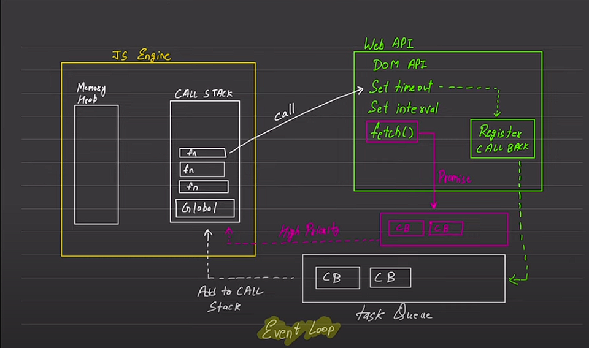

# javascript->
    synchronous
    single threaded

## execution context->

    executes one line at a time
    next operation waits for previous one to complete

## blocking code vs non-blocking code->

    ### blocking code-> blocks the flow of code -> read file sync
    non-blocking code-> Does not blocks the flow of code -> read file Async

